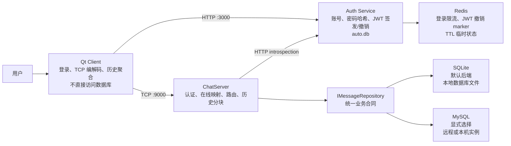

# ChatHub

ChatHub 是一个 Windows 本地开发的单机聊天项目：Qt 客户端通过 HTTP 登录取得 JWT，再通过 TCP 与 ChatServer 聊天；ChatServer
通过 Auth Service introspection 完成 TCP 新连接认证，并通过统一的 `IMessageRepository` 使用 SQLite 或 MySQL 持久化消息。
Redis 只保存登录限流和 JWT 撤销 marker 等带 TTL 的认证临时状态；SQLite 是默认消息后端，MySQL 需要在启动时显式选择。

本 README
只记录已实现且有验证证据的行为。需求、协议细节和故障复现分别见 [W10 需求](docs/W10需求文档-交付稳定性.md)、
[W11 MySQL 需求](docs/W11需求文档-MySQL集成与存储抽象.md)、[W12 Redis/认证需求](docs/W12需求文档-Redis临时状态与认证安全.md)、
[协议总图](docs/ChatHub协议字段与状态流向总图.md) 和 [W10 故障记录](docs/故障记录/W10-交付稳定性故障记录.md)。

## 1. 单机架构与数据所有权



| 组件                  | 拥有的状态                                     | 不负责的事                 |
|---------------------|-------------------------------------------|-----------------------|
| Qt Client           | 登录态、TCP 连接、在线快照缓存、`m_conversations` UI 模型 | 不直接操作数据库或伪造发送者身份 |
| Auth Service        | 用户账号、bcrypt 密码哈希、JWT 签发、Redis 登录限流与撤销 marker                   | 不维护在线状态、消息路由或聊天历史     |
| ChatServer          | TCP Session、通过 Auth introspection 得到的认证用户名、待送达索引、消息路由            | 不直接读取 Redis，不信任客户端正文中的发送者身份       |
| `IMessageRepository` | ChatServer 的消息持久化业务接口；由 SQLite 或 MySQL 后端实现 | 不操作 UI/TCP Socket，不向上层暴露 SQL 或数据库句柄 |

`local_id` 由发送客户端生成，用于重试和更新既有气泡；`message_id` 由 ChatServer 首次成功入库时生成，用于持久身份、历史去重和送达回执；
`request_id` 只关联一轮历史查询。三者不能互换。

## 2. 当前边界

- 单机、单 ChatServer；不支持多服务器路由。
- `online_users` 是完整快照，最多 88 个、每个 3–20B 的 ASCII 用户名；不分页、不分块。
- 单条聊天正文最多 1024B，所有协议帧正文最多 2048B。
- 无离线推送、多端同步、群聊或好友关系；Redis 仅用于登录限流和受控 JWT 撤销，不保存聊天正文或用户密码；消息存储支持默认 SQLite 和显式选择的 MySQL，两种后端保持相同业务合同。
- `PendingDeliveryMap` 只存在于 Server 进程内；重启后历史中的本人消息最多恢复为 `Accepted`，不会伪造为 `Delivered`。
- ChatServer 的新 TCP auth 通过 `CHATHUB_AUTH_INTROSPECTION_URL` 和内部服务密钥调用 Auth Service；Auth Service 再验证 JWT 并查询 Redis
  撤销 marker。不要把内部密钥、签名密钥、JWT 或数据库内容写入 README、Git、日志或测试夹具。
- 启动日志会输出实际数据库路径与认证超时；会话错误日志已统一为带 `session_id`、`phase`、`event`、`code` 的结构化记录，并且不回显入站
  `error` 正文。

## 3. Windows 依赖与首次配置

当前根 `CMakeLists.txt` 使用以下本机开发路径；在其他机器上先安装等价依赖并调整为自己的路径：

- CMake 3.21+、Ninja、支持 C++17 的 MinGW；
- Qt 6.11.1（Core、Gui、Widgets、Network）；
- standalone Asio、Boost.JSON、OpenSSL、SQLite3、jwt-cpp；
- vcpkg manifest 与 MariaDB Connector/C（`libmariadb >= 3.4.8`）；当前 MinGW 构建使用 `x64-mingw-dynamic` triplet；
- Node.js 与 npm（Auth Service）；
- Redis 8.x 或兼容 `SET`/`EXPIRE`/`EXISTS`/`INCR` 的本机实例（当前开发环境通过 WSL 提供）。

项目根目录的 `vcpkg.json` 声明 `libmariadb`。CMake 必须使用与 Qt MinGW 13.1 匹配的 vcpkg toolchain 和
`x64-mingw-dynamic` triplet，不能把 MSVC 的 `x64-windows` 库与 MinGW 目标混用。构建 `chat-server` 后，CMake 会把
`libmariadb` 所需的认证插件复制到可执行文件旁的 `plugins/libmariadb` 目录。

Auth Service 首次使用时在 `auth-service` 目录运行 `npm install`。它从私有 `.env` 读取 `CHATHUB_REDIS_URL`、`SECRET_KEY` 和
`CHATHUB_AUTH_INTERNAL_SERVICE_KEY`；可选的 `CHATHUB_REDIS_KEY_PREFIX`、`CHATHUB_LOGIN_USER_LIMIT`、`CHATHUB_LOGIN_IP_LIMIT`、
`CHATHUB_LOGIN_WINDOW_SECONDS` 用于认证临时状态配置。`.env` 和 `auto.db` 都是本机数据，不提交；README 不记录任何实际密钥。

## 4. 构建与自动化验证

在仓库根目录执行：

```powershell
cmake -S D:\CppLearn\chathub `
  -B D:\CppLearn\chathub\cmake-build-debug-mysql `
  -G Ninja `
  -DCMAKE_CXX_COMPILER=D:\QT\Tools\mingw1310_64\bin\c++.exe `
  -DCMAKE_MAKE_PROGRAM=D:\CLion\bin\ninja\win\x64\ninja.exe `
  -DCMAKE_PREFIX_PATH=D:\QT\6.11.1\mingw_64 `
  -DCMAKE_TOOLCHAIN_FILE=D:\CppLearn\tools\vcpkg\scripts\buildsystems\vcpkg.cmake `
  -DVCPKG_TARGET_TRIPLET=x64-mingw-dynamic

cmake --build D:\CppLearn\chathub\cmake-build-debug-mysql --parallel 2
ctest --test-dir D:\CppLearn\chathub\cmake-build-debug-mysql --output-on-failure
```

`ctest` 不会先编译；每次修改后先执行 `cmake --build`，再运行 CTest。当前回归集包含帧解码、Repository、历史响应、运行配置、真实
Server 子进程、在线快照/认证截止、Qt 历史客户端和会话排序测试。

Auth Service 的语法检查在其目录执行：

```powershell
node --check src/server.js
node --check src/db.js
```

Auth Service 的测试分为普通模块/HTTP 测试和真实跨进程撤销 E2E。两者都必须显式提供专用 Redis 地址；E2E 固定使用 Auth
Service 的生产端口 `3000`，不要和其他启动 Auth Service 的命令并行运行：

```powershell
Set-Location D:\CppLearn\chathub\auth-service
$env:CHATHUB_REDIS_TEST_URL = '<仅当前终端的专用测试 URL>'
npm test
npm run test:e2e
```

`npm run test:e2e` 默认使用 `D:\CppLearn\chathub\cmake-build-debug-mysql\chat-server\chat-server.exe`；如需使用其他构建产物，
可在当前终端设置 `CHATHUB_CHAT_SERVER_EXECUTABLE`。测试为 Auth Service 和 ChatServer 各自创建临时工作目录/数据库，并为每次运行
生成唯一 Redis key prefix，结束时清理本次资源。

提交前再执行：

```powershell
git diff --check
```

构建产物、`*.db`、`.env`、令牌和本地学习笔记不应暂存。

## 5. 启动与关闭顺序

1. 确认 Redis 已运行，然后启动 Auth Service：

   ```powershell
   Set-Location D:\CppLearn\chathub\auth-service
   $env:CHATHUB_REDIS_URL = 'redis://127.0.0.1:6379'
   $env:SECRET_KEY = '<仅当前终端的本地签名密钥>'
   $env:CHATHUB_AUTH_INTERNAL_SERVICE_KEY = '<仅当前终端的内部服务密钥>'
   npm start
   ```

   它监听本机 `3000` 端口，并在当前目录创建或打开 `auto.db`；启动前会先连接 Redis，依赖失败时不监听 HTTP。

2. 启动 ChatServer。未指定后端时默认使用 SQLite。先创建只用于本地运行的数据库目录：

   ```powershell
   Set-Location D:\CppLearn\chathub
   $env:CHATHUB_AUTH_INTROSPECTION_URL = 'http://127.0.0.1:3000/internal/auth/introspect'
   $env:CHATHUB_AUTH_INTERNAL_SERVICE_KEY = '<与 Auth Service 相同的本地内部服务密钥>'
   New-Item -ItemType Directory -Force .\run-data
   .\cmake-build-debug-mysql\chat-server\chat-server.exe --port 9000 --database-path .\run-data\chathub.db --auth-timeout-ms 5000
   ```

   要显式使用 MySQL，只把主机、端口、用户名和数据库名放在命令行；密码由当前 ChatServer 进程通过
   `CHATHUB_MYSQL_PASSWORD` 读取。下面的 PowerShell 示例隐藏密码输入，并在 ChatServer 退出后清除当前终端中的临时环境变量：

   ```powershell
   $secureMySqlPassword = Read-Host 'MySQL 密码' -AsSecureString
   $env:CHATHUB_MYSQL_PASSWORD =
       [System.Net.NetworkCredential]::new('', $secureMySqlPassword).Password

   try {
       .\cmake-build-debug-mysql\chat-server\chat-server.exe `
         --port 9000 `
         --auth-timeout-ms 5000 `
         --storage-backend mysql `
         --mysql-host 127.0.0.1 `
         --mysql-port 3306 `
         --mysql-username your_mysql_user `
         --mysql-database chathub
   }
   finally {
       Remove-Item Env:CHATHUB_MYSQL_PASSWORD -ErrorAction SilentlyContinue
   }
   ```

   MySQL 模式必须显式提供 `--mysql-username` 和 `--mysql-database`；`--mysql-host`、`--mysql-port` 默认分别为
   `127.0.0.1`、`3306`。MySQL 参数不能与 `--database-path` 混用。Factory 会在服务器监听前完成连接和 Schema 初始化；
   缺失密码、连接失败、认证插件不可用或 Schema 初始化失败都会非零退出，不会留下一个无法持久化消息的监听端口。要回退到 SQLite，
   去掉全部 `--mysql-*` 参数并把 `--storage-backend` 改为 `sqlite`，或直接省略后端参数。

   通用参数默认值为端口 `9000`、SQLite 数据库 `chathub.db`、认证截止 `5000ms`。端口必须为 `1–65535`，认证截止必须为
   `1000–30000ms`；非法、重复、未知或缺值参数会在创建监听器和数据库前以 `configuration_error: <code>` 非零退出。

3. 启动 Qt Client：

   ```powershell
   Set-Location D:\CppLearn\chathub
   .\cmake-build-debug-mysql\client-qt\client-qt.exe
   ```

   先在登录窗口注册或登录，再由客户端连接 ChatServer。

4. 关闭顺序：先关闭所有 Qt Client；再在 ChatServer 和 Auth Service 控制台分别按 `Ctrl+C`。不要把运行数据库或 `.env` 纳入
   Git。

## 6. TCP 协议速查

每帧固定 8B 头部：魔数 `0x4348`、版本 `1`、`type`、正文长度；正文上限 2048B。

|  type | 名称                 | 方向与作用                                                                              |
|------:|--------------------|------------------------------------------------------------------------------------|
|     1 | `chat`             | Client 发送 `{ to, content, local_id, send_at }`；Server 持久化后向接收方转发带 `message_id` 的消息 |
| 2 / 3 | `ping` / `pong`    | 心跳请求与响应                                                                            |
|     4 | `error`            | `{ scope, code, message, local_id? }`；带 `local_id` 时定位发送方失败气泡                      |
|     5 | `auth`             | Client 发送 JWT；成功响应 `{ ok: true }`                                                  |
|     6 | `chat_ack`         | `{ local_id, message_id, status: "accepted", server_received_at_ms }`              |
|     7 | `delivery_receipt` | 接收方以 `message_id` 回执；Server 向发送方回传 `{ local_id, status: "delivered" }`             |
|     8 | `online_users`     | `{ users: [...] }` 完整在线用户快照                                                        |
|     9 | `history_query`    | `{ request_id, limit, before? }`；身份只从认证 Session 推导                                 |
|    10 | `history_result`   | `{ request_id, messages, is_last_chunk, has_more, next_cursor }`；按实际编码字节分块         |

本期常见稳定错误码包括：`database_unavailable`、`database_write_failed`、`database_read_failed`、`invalid_username_claim`、
`online_snapshot_capacity_exceeded`、`authentication_timeout`。测试应断言 `scope/code`，不依赖展示文案。

## 7. 演示与验收路径

| 场景       | 操作                                                                                                               | 可观察结果                                                                               |
|----------|------------------------------------------------------------------------------------------------------------------|-------------------------------------------------------------------------------------|
| 双账户聊天    | 启动两个 Client，分别注册/登录 Alice、Bob；Alice 向 Bob 发送消息                                                                   | Bob 收到消息；Alice 依次显示已接受、送达                                                           |
| 三账户连续聊天  | Alice、Bob、Carol 依次登录，执行 A→B、B→C、C→A                                                                              | 第三人不收到无关私聊；三人在线快照和心跳保持可用                                                            |
| 重启后历史    | 先完成一轮聊天，关闭并重启 ChatServer，再登录原用户                                                                                  | 客户端认证后请求最近 50 条历史；按 `(server_received_at_ms, message_id)` 正序合并，不重复                  |
| 认证超时     | 运行 `ctest --test-dir D:\CppLearn\chathub\cmake-build-debug-mysql -R "online_users_integration_test\|server_process_config_test" --output-on-failure` | 未认证连接收到 `scope=auth` / `code=authentication_timeout` 后关闭 |
| 第 89 人拒绝 | 运行 `ctest --test-dir D:\CppLearn\chathub\cmake-build-debug-mysql -R online_users_integration_test --output-on-failure` | 第 89 名候选收到 `scope=online_users` / `code=online_snapshot_capacity_exceeded`；已有用户不受影响 |

更细的故障临时环境、根因、保护机制和回归命令见 [W10 故障记录](docs/故障记录/W10-交付稳定性故障记录.md)。

## 8. 项目文档

- [W10 交付稳定性需求](docs/W10需求文档-交付稳定性.md)
- [协议字段与状态流向总图](docs/ChatHub协议字段与状态流向总图.md)
- [W10 故障记录](docs/故障记录/W10-交付稳定性故障记录.md)
- [文档索引](docs/README.md)
