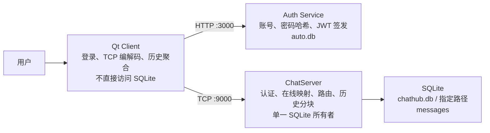

# ChatHub

ChatHub 是一个 Windows 本地开发的单机聊天项目：Qt 客户端通过 HTTP 登录取得 JWT，再通过 TCP 与 ChatServer 聊天；ChatServer 使用 SQLite 持久化消息并提供认证后的历史首屏。

本 README 只记录已实现且有验证证据的行为。需求、协议细节和故障复现分别见 [W10 需求](docs/W10需求文档-交付稳定性.md)、[协议总图](docs/ChatHub协议字段与状态流向总图.md) 和 [W10 故障记录](docs/故障记录/W10-交付稳定性故障记录.md)。

## 1. 单机架构与数据所有权



| 组件 | 拥有的状态 | 不负责的事 |
|---|---|---|
| Qt Client | 登录态、TCP 连接、在线快照缓存、`m_conversations` UI 模型 | 不直接操作 SQLite 或伪造发送者身份 |
| Auth Service | 用户账号、bcrypt 密码哈希、JWT 签发 | 不维护在线状态、消息路由或聊天历史 |
| ChatServer | TCP Session、认证用户名映射、待送达索引、消息路由 | 不信任客户端正文中的发送者身份 |
| `MessageRepository` | ChatServer 唯一 SQLite API；`messages` 的读写 | 不操作 UI 或 TCP Socket |

`local_id` 由发送客户端生成，用于重试和更新既有气泡；`message_id` 由 ChatServer 首次成功入库时生成，用于持久身份、历史去重和送达回执；`request_id` 只关联一轮历史查询。三者不能互换。

## 2. 当前边界

- 单机、单 ChatServer；不支持多服务器路由。
- `online_users` 是完整快照，最多 88 个、每个 3–20B 的 ASCII 用户名；不分页、不分块。
- 单条聊天正文最多 1024B，所有协议帧正文最多 2048B。
- 无离线推送、多端同步、群聊、好友关系、Redis 或 MySQL。
- `PendingDeliveryMap` 只存在于 Server 进程内；重启后历史中的本人消息最多恢复为 `Accepted`，不会伪造为 `Delivered`。
- 当前 ChatServer 的 JWT 验证器仍是开发期配置，未提供外部密钥参数；Auth Service 的私有 `.env` 必须与其匹配。不要把密钥、JWT 或数据库内容写入 README、Git、日志或测试夹具。
- 启动日志会输出实际数据库路径与认证超时；会话错误日志已统一为带 `session_id`、`phase`、`event`、`code` 的结构化记录，并且不回显入站 `error` 正文。

## 3. Windows 依赖与首次配置

当前根 `CMakeLists.txt` 使用以下本机开发路径；在其他机器上先安装等价依赖并调整为自己的路径：

- CMake 3.21+、Ninja、支持 C++17 的 MinGW；
- Qt 6.8（Core、Gui、Widgets、Network）；
- standalone Asio、Boost.JSON、OpenSSL、SQLite3、jwt-cpp；
- Node.js 与 npm（Auth Service）。

Auth Service 首次使用时在 `auth-service` 目录运行 `npm install`。它从私有 `.env` 读取 `SECRET_KEY`；该文件和 `auto.db` 都是本机数据，不提交。当前工作站的私有配置已验证与 ChatServer 开发验证器一致，但 README 不记录其值。

## 4. 构建与自动化验证

在仓库根目录执行：

```powershell
cmake -S D:\CppLearn\chathub -B D:\CppLearn\chathub\cmake-build-debug -G Ninja
cmake --build D:\CppLearn\chathub\cmake-build-debug --parallel 2
ctest --test-dir D:\CppLearn\chathub\cmake-build-debug --output-on-failure
```

`ctest` 不会先编译；每次修改后先执行 `cmake --build`，再运行 CTest。当前回归集包含帧解码、Repository、历史响应、运行配置、真实 Server 子进程、在线快照/认证截止、Qt 历史客户端和会话排序测试。

Auth Service 的语法检查在其目录执行：

```powershell
node --check src/server.js
node --check src/db.js
```

提交前再执行：

```powershell
git diff --check
```

构建产物、`*.db`、`.env`、令牌和本地学习笔记不应暂存。

## 5. 启动与关闭顺序

1. 启动 Auth Service：

   ```powershell
   Set-Location D:\CppLearn\chathub\auth-service
   npm start
   ```

   它监听本机 `3000` 端口，并在当前目录创建或打开 `auto.db`。

2. 启动 ChatServer。先创建只用于本地运行的数据库目录：

   ```powershell
   Set-Location D:\CppLearn\chathub
   New-Item -ItemType Directory -Force .\run-data
   .\cmake-build-debug\chat-server\chat-server.exe --port 9000 --database-path .\run-data\chathub.db --auth-timeout-ms 5000
   ```

   参数均可省略，默认值为端口 `9000`、数据库 `chathub.db`、认证截止 `5000ms`。端口必须为 `1–65535`，认证截止必须为 `1000–30000ms`；非法、重复、未知或缺值参数会在创建监听器和数据库前以 `configuration_error: <code>` 非零退出。

3. 启动 Qt Client：

   ```powershell
   Set-Location D:\CppLearn\chathub
   .\cmake-build-debug\client-qt\client-qt.exe
   ```

   先在登录窗口注册或登录，再由客户端连接 ChatServer。

4. 关闭顺序：先关闭所有 Qt Client；再在 ChatServer 和 Auth Service 控制台分别按 `Ctrl+C`。不要把运行数据库或 `.env` 纳入 Git。

## 6. TCP 协议速查

每帧固定 8B 头部：魔数 `0x4348`、版本 `1`、`type`、正文长度；正文上限 2048B。

| type | 名称 | 方向与作用 |
|---:|---|---|
| 1 | `chat` | Client 发送 `{ to, content, local_id, send_at }`；Server 持久化后向接收方转发带 `message_id` 的消息 |
| 2 / 3 | `ping` / `pong` | 心跳请求与响应 |
| 4 | `error` | `{ scope, code, message, local_id? }`；带 `local_id` 时定位发送方失败气泡 |
| 5 | `auth` | Client 发送 JWT；成功响应 `{ ok: true }` |
| 6 | `chat_ack` | `{ local_id, message_id, status: "accepted", server_received_at_ms }` |
| 7 | `delivery_receipt` | 接收方以 `message_id` 回执；Server 向发送方回传 `{ local_id, status: "delivered" }` |
| 8 | `online_users` | `{ users: [...] }` 完整在线用户快照 |
| 9 | `history_query` | `{ request_id, limit, before? }`；身份只从认证 Session 推导 |
| 10 | `history_result` | `{ request_id, messages, is_last_chunk, has_more, next_cursor }`；按实际编码字节分块 |

本期常见稳定错误码包括：`database_unavailable`、`database_write_failed`、`database_read_failed`、`invalid_username_claim`、`online_snapshot_capacity_exceeded`、`authentication_timeout`。测试应断言 `scope/code`，不依赖展示文案。

## 7. 演示与验收路径

| 场景 | 操作 | 可观察结果 |
|---|---|---|
| 双账户聊天 | 启动两个 Client，分别注册/登录 Alice、Bob；Alice 向 Bob 发送消息 | Bob 收到消息；Alice 依次显示已接受、送达 |
| 三账户连续聊天 | Alice、Bob、Carol 依次登录，执行 A→B、B→C、C→A | 第三人不收到无关私聊；三人在线快照和心跳保持可用 |
| 重启后历史 | 先完成一轮聊天，关闭并重启 ChatServer，再登录原用户 | 客户端认证后请求最近 50 条历史；按 `(server_received_at_ms, message_id)` 正序合并，不重复 |
| 认证超时 | 运行 `ctest --test-dir D:\CppLearn\chathub\cmake-build-debug -R "online_users_integration_test|server_process_config_test" --output-on-failure` | 未认证连接收到 `scope=auth` / `code=authentication_timeout` 后关闭 |
| 第 89 人拒绝 | 运行 `ctest --test-dir D:\CppLearn\chathub\cmake-build-debug -R online_users_integration_test --output-on-failure` | 第 89 名候选收到 `scope=online_users` / `code=online_snapshot_capacity_exceeded`；已有用户不受影响 |

更细的故障临时环境、根因、保护机制和回归命令见 [W10 故障记录](docs/故障记录/W10-交付稳定性故障记录.md)。

## 8. 项目文档

- [W10 交付稳定性需求](docs/W10需求文档-交付稳定性.md)
- [协议字段与状态流向总图](docs/ChatHub协议字段与状态流向总图.md)
- [W10 故障记录](docs/故障记录/W10-交付稳定性故障记录.md)
- [文档索引](docs/README.md)
