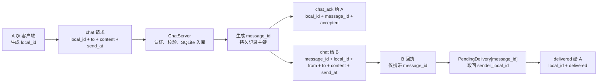
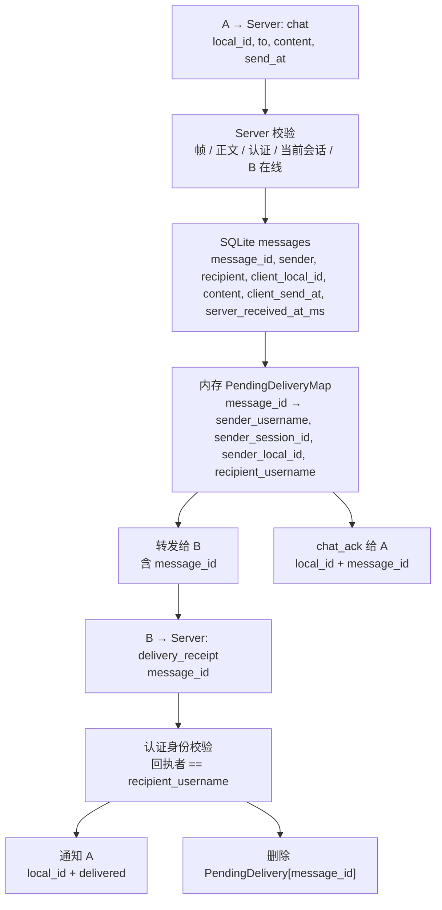
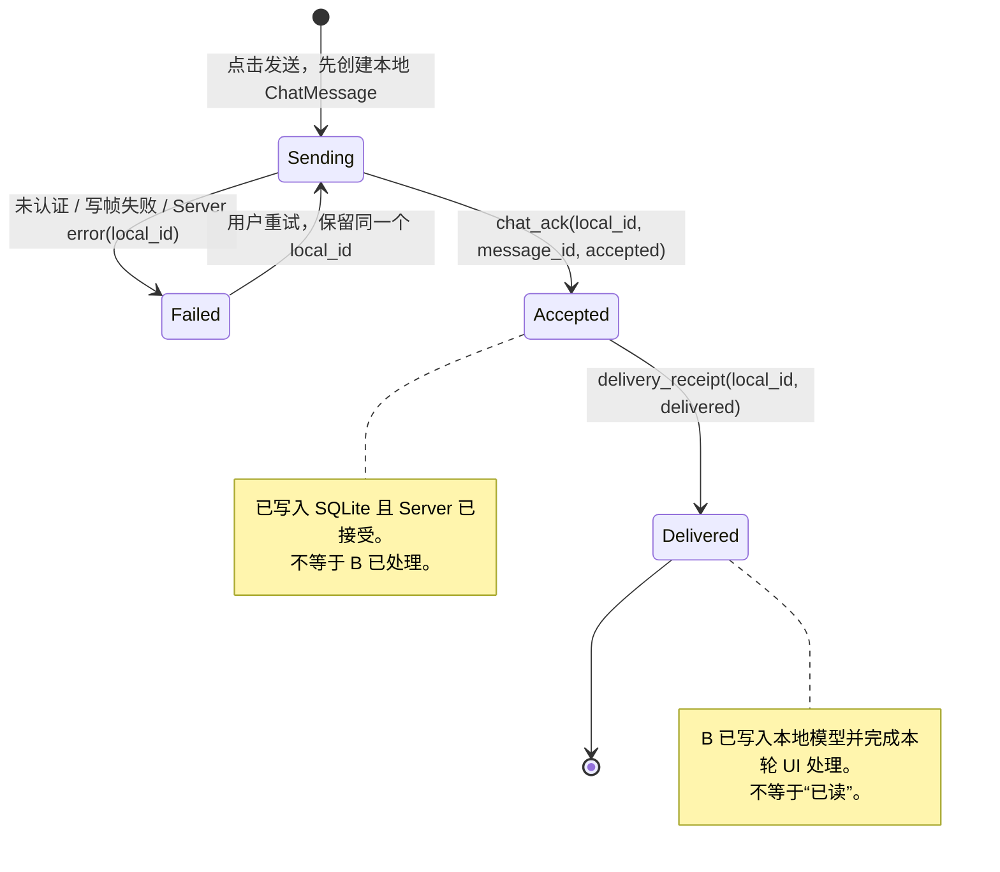
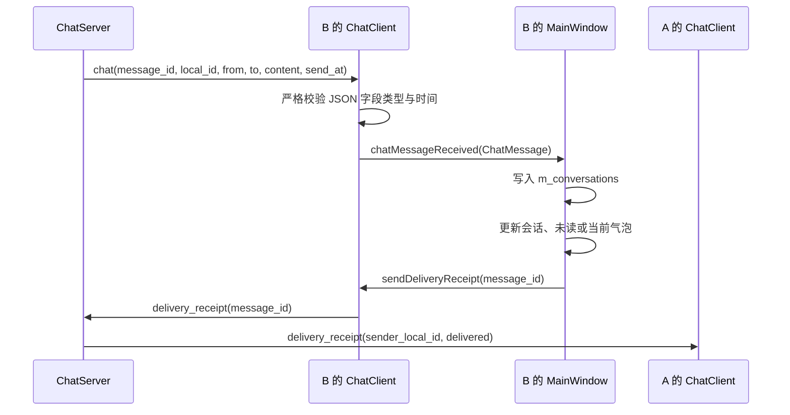

# ChatHub 协议字段与状态流向总图

> 状态：持续维护 | 创建：2026-08-13 | 当前范围：W8 已实现 + W9 已确定的协议合同
>
> 用途：任何新增、删除或变更协议字段、消息身份、状态值前，先更新本文件；实现、测试和需求文档在同一次提交中同步更新。本文件用于核对流向，具体校验规则以对应需求文档和代码为准。

---

## 一、使用规则

每次改协议时按下面顺序检查，而不是只搜索字段名：

```text
字段生成者
  → 发出帧 JSON
  → 接收帧 JSON 校验
  → 服务端内存 / SQLite
  → Qt ChatMessage 模型
  → UI 状态或渲染
  → 单元测试 / 人工验收
```

变更清单：

- [ ] 在“字段责任表”中写清生成者、唯一性和用途；
- [ ] 在“帧正文合同”中增删相应字段；
- [ ] 在“状态机”中写清新状态的进入和退出条件；
- [ ] 更新服务端解析、客户端解析、内存结构和 SQLite 映射；
- [ ] 为正常、缺失字段、错误类型和重复请求补测试；
- [ ] 更新对应 W8/W9 需求文档和学习笔记。

---

## 二、核心字段责任表

| 字段 | 生成者 | 唯一范围 | 主要用途 | 不应承担的职责 |
|---|---|---|---|---|
| `local_id` | A 的 Qt 客户端 | 同一发送者的发送意图 | 本地气泡定位、重试幂等键、`chat_ack` 与错误帧关联 | B 的回执、历史去重、跨用户全局身份 |
| `message_id` | ChatServer，首次 SQLite 成功提交时 | 全局 | 持久消息主键、B 的 `delivery_receipt`、历史去重、稳定排序平手决胜 | A 侧发送前的临时气泡定位 |
| `from` | ChatServer 从认证 Session 推导 | 一条消息 | 真实发送者、B 的会话归属 | 客户端自报身份 |
| `to` | A 提交，ChatServer 校验在线状态 | 一条消息 | 接收者、SQLite `recipient` | 回执发送者身份 |
| `content` | A 的 Qt 客户端 | 一条消息 | 聊天正文，最多 1024 字节 | UI 状态或服务端排序依据 |
| `send_at` | A 的 Qt 客户端 | 一条消息 | UI 展示时间，ISO UTC 字符串 | 服务端可信历史排序 |
| `server_received_at_ms` | ChatServer 首次入库前 | 一条持久记录 | 历史排序；与 `message_id` 组成稳定游标 | UI 发送时间显示 |
| `status` | 协议发送者 | 状态通知帧 | `accepted`、`delivered` 的状态语义 | 消息的持久化身份 |
| `failure_reason` | Qt 客户端从错误帧转换 | 本地模型 | Failed 气泡的显示原因 | 网络协议字段 |
| `sender_session_id` | ChatServer | 当前进程 | 待送达时找到 A 的当前连接 | 持久消息身份或跨重启恢复 |
| `recipient_username` | ChatServer | 当前进程 | 验证回执者确为 B | 从回执正文取得身份 |

### `local_id` 与 `message_id` 的分工



结论：`message_id` 负责跨网络、跨用户、可持久的“这是哪条消息”；`local_id` 负责 A 本地“要更新哪个既有气泡”。

---

## 三、帧正文合同

`type`、帧方向和字段必须一起理解。客户端发送的 `chat` 没有 `message_id`，因为它尚未入库；服务端转发给 B 后才有。

| type | 名称 / 方向 | 当前正文 | 关键校验与副作用 |
|---:|---|---|---|
| 1 | `chat`，A → Server | `{ to, content, local_id, send_at }` | Server 从认证会话取得真实 `from`；校验字段、认证、接收者在线、SQLite 写入 |
| 1 | `chat`，Server → B | `{ message_id, local_id, from, to, content, send_at }` | B 全部字段必须为非空字符串，`send_at` 必须可解析；写入 `ChatMessage` 后再回执 |
| 4 | `error`，Server → Client | `{ scope, code, message, local_id? }` | 有 `local_id`：A 将指定气泡置为 `Failed`；无 `local_id`：作为普通服务端错误 |
| 5 | `auth`，Client → Server | JWT 原始文本 | 未认证 Session 只接受此帧 |
| 5 | `auth`，Server → Client | `{ ok: true }` | 客户端进入已认证状态 |
| 6 | `chat_ack`，Server → A | `{ local_id, message_id, status: "accepted" }` | A 用 `local_id` 找到既有气泡，写入 `message_id`，状态改为 `Accepted` |
| 7 | `delivery_receipt`，B → Server | `{ message_id }` | Server 校验 B 的认证身份等于 `PendingDelivery::recipient_username` |
| 7 | `delivery_receipt`，Server → A | `{ local_id, status: "delivered" }` | A 仅改既有气泡状态，不新建气泡、不置顶 |
| 8 | `online_users`，Server → Client | `{ users: ["alice", "bob"] }` | 客户端严格校验字符串数组、去重后整体替换在线列表 |
| 9 | `history_query`，Client → Server | `{ request_id, limit, before? }` | **W9 待实现**；身份只能从认证 Session 推导 |
| 10 | `history_result`，Server → Client | `{ request_id, messages, is_last_chunk, has_more, next_cursor }` | **W9 待实现**；每条历史记录含 `message_id`，客户端据此去重 |

其中 W9 历史单条记录的预定字段：

```json
{
  "message_id": "server-uuid",
  "local_id": "sender-client-local-id",
  "from": "alice",
  "to": "bob",
  "content": "hello",
  "send_at": "2026-08-12T10:00:00.000Z",
  "server_received_at_ms": 1786490400000
}
```

---

## 四、服务端数据流与保存位置



| 位置 | 保存什么 | 生命周期 | 重启后 |
|---|---|---|---|
| A 的 `ChatMessage` | `local_id`、收到 ack 后的 `message_id`、展示状态 | 客户端当前内存，W9 后扩展为历史合并来源 | 当前版本不恢复 |
| SQLite `messages` | 一条消息的完整持久业务数据 | 数据库 | 保留，可供历史查询 |
| `PendingDeliveryMap` | 回执归属与 A 侧气泡定位信息，不保存正文 | Server 进程内，直至回执或相关断线 | 清空，不能恢复 `Delivered` |

---

## 五、发送方 A 的状态机



状态变更约束：

| 状态 | 进入条件 | 可改动的数据 | 禁止行为 |
|---|---|---|---|
| `Sending` | 本地创建消息或对失败消息重试 | `status`、`failure_reason` | 仅恢复 Sending 时置顶会话 |
| `Failed` | 本地失败或带 `local_id` 的服务端错误 | `status`、`failure_reason` | 不创建第二个气泡 |
| `Accepted` | 收到合法 `chat_ack` | `message_id`、`status`、清空失败原因 | 不代表 B 已收到 |
| `Delivered` | 收到合法服务端最终通知 | `status`、清空失败原因 | 不新建气泡、不增加未读、不置顶 |
| `Received` | B 收到 Server 转发的 chat | 完整消息字段 | 不能显示为本人“已送达” |

---

## 六、接收方 B 的本地处理顺序



回执的含义是“B 已完成本阶段规定的本地模型和 UI 处理”。若 B 的回执发送失败，B 已收到的消息不回滚，A 维持 `Accepted`。

---

## 七、异常与重复路径

| 场景 | 使用的关联字段 | 预期结果 |
|---|---|---|
| A 用同一请求重试 | `local_id` + 认证发送者 | SQLite 返回既有 `message_id`；不重复写入、不重复转发 |
| A 复用 `local_id` 但正文不同 | `local_id` + 认证发送者 | `idempotency_conflict`，原持久记录不变 |
| B 回执未知 `message_id` | `message_id` | Server 只回复回执错误，不通知 A |
| C 猜中某条 `message_id` | `message_id` + C 的认证身份 | `recipient_username` 不匹配，拒绝，不通知 A |
| B 重复回执 | `message_id` | 第一条回执后待送达记录已删除；第二条被拒绝 |
| A 或真正离线的 B 断线 | `sender_session_id` / `recipient_username` | 删除相关 `PendingDelivery`；A 不被伪造为 `Delivered` |
| ChatServer 重启 | 内存表清空 | SQLite 历史仍在；`Delivered` 不恢复 |

---

## 八、关联文档

- [W9 需求文档：SQLite 持久化](W9需求文档-SQLite持久化.md)
- [W8-9 最终送达回执需求文档](W8-9最终送达回执需求文档.md)
- [W8 私聊路由学习笔记](../../笔记/06-Qt框架/笔记-ChatHub-W8私聊路由.md)
