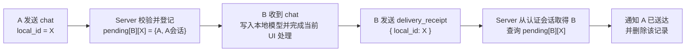
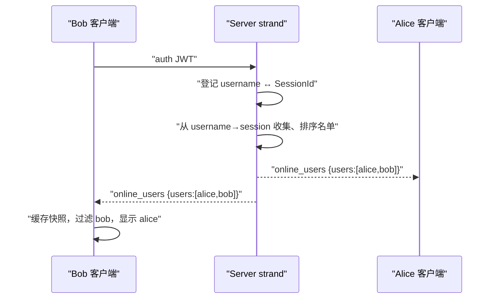

# 笔记：W8 私聊路由 — 从广播到按用户转发

> 2026-08-05 | ChatHub | 目标：让 chat-server 把消息只发给指定用户，而不是广播所有人

---

## 一、它解决什么问题

W7 结束时，chat-server 收到一条 chat 消息是**广播给所有在线用户**（跳过发送者）：

```
A 发 "Hello" → 发给 B、C、D、E...（所有在线）
```

但聊天应该是**私聊**：

```
A 发 {"to":"B", "content":"你好"} → 只发给 B
```

**广播的缺点**：
- 所有用户收到所有人的消息，毫无隐私
- 客户端要自己过滤"这条是不是给我的"，浪费流量
- 多人聊天室可以，但一对一私聊不行

---

## 二、核心设计：用户名 → 连接 的映射表

### 为什么需要映射表

服务端要"把消息发给 B"，必须先知道"B 是哪个 TCP 连接"：

```
B 在连接 #7（TCP socket）
→ 服务端必须有一张表：B → #7
→ 没有这张表，服务端拿到 {"to":"B"} 无从下手
```

### 两张表（双向映射）

| 表 | 键 → 值 | 用途 |
|----|---------|------|
| `m_username_to_session` | 用户名 → SessionId | 查"B 在哪个连接" |
| `m_session_to_username` | SessionId → 用户名 | 断开时查"连接#7 是谁" |

**为什么两张**：增删都要双向操作。

- 加（认证成功）：两个方向都登记
- 删（断开）：只拿到 SessionId，需要反表查出用户名，才能删正表

**删除的 O(1)**：没有反表的话，要遍历正表找"值是 SessionId"的项，O(n)。反表让删除变 O(1)。

---

## 三、认证回调：Session 告诉 Server"我是谁"

### 问题

用户名存在 Session 里（verifyJwt 解析 token 得到），但 Server 不知道——Server 只看到"连接 #5 进来了"。

### 解决：认证回调

```
Session 认证成功（verifyJwt 通过）
  → 调用 m_on_authenticated(m_id, m_username)   // 回调
  → Server 登记：m_username_to_session["alice"] = 5
```

### 回调的类型定义

```cpp
// session.h
using AuthenticatedCallback = std::function<void(SessionId, const std::string&)>;
```

| 部分 | 含义 |
|------|------|
| `SessionId` | 谁认证了（连接 ID） |
| `const std::string&` | 认证成谁（用户名） |
| `void` 返回 | 只是通知，不需要返回值 |

### 为什么是"Session 调回调"，而不是"Server 问 Session"

- **Session 是唯一知道"认证成谁"的地方**（它验 JWT）
- **Server 是唯一能"发给别人"的地方**（它有全部在线表）
- 时机由 Session 掌握（它读到 auth 帧那一刻才知道）
- → 用回调：Session 主动报信，Server 被动登记

### 判空为什么必须

```cpp
if (m_on_authenticated) {   // ← 必须判空
    m_on_authenticated(m_id, m_username);
}
```

`std::function` 可能没绑定（空容器）。直接调用空 std::function 会抛 `std::bad_function_call` 崩溃。先判空再调。

### asio::post 为什么必须

```cpp
auto on_authenticated = [this](SessionId id, std::string name) {
    asio::post(m_strand, [this, id, name]() {
        m_username_to_session.emplace(name, id);   // 登记
    });
};
```

`m_username_to_session` 是 Server 的共享数据。Session 的回调可能从其他线程/上下文触发。直接操作 map → 并发访问 → 数据竞争 → 崩溃。`asio::post(strand)` 把所有 map 操作排成队，保证串行。

---

## 四、私聊路由：sendToUser

### 消息格式变化

chat 消息的 body 从纯文本改成 JSON：

```json
{"to": "bob", "content": "你好"}
```

### 服务端转发流程

```cpp
void Server::sendToUser(SessionId sender_id, const protocol::Message& message) {
    // 1. 解析 JSON，拿 to 和 content
    boost::json::value jv = boost::json::parse(message.body);
    auto to = jv.at("to").as_string();
    auto content = jv.at("content").as_string();

    // 2. string_view → std::string（map 查找需要）
    std::string to_name(to.data(), to.size());
    std::string content_str(content.data(), content.size());

    // 3. 查正表：接收者在不在线
    auto it = m_username_to_session.find(to_name);
    if (it != m_username_to_session.end()) {
        // 4. 查 Session 表，拿接收者的 Session
        auto recv_it = m_sessions.find(it->second);
        if (recv_it != m_sessions.end()) {
            // 5. 转发：只发给接收者
            recv_it->second->send(message.type, content_str);
        }
    }
}
```

### 为什么 sender_id 参数现在没用

sendToUser 签名里有 `sender_id` 但没用它——因为现在只关心"发给谁"（to），不需要"跳过谁"（广播才需要跳过发送者）。留着是将来扩展用（比如发错误反馈给发送者）。

---

## 五、验证结果

用 Python 模拟 3 个用户（alice8/bob8/carol8）认证连接：

| 场景 | 结果 |
|------|------|
| alice8 私聊 bob8 | ✅ bob8 收到 "secret for bob" |
| carol8 会收到吗 | ✅ 只收到认证成功帧，**没收到私聊** |
| 服务端日志 | ✅ 只出现一次"发送成功：22字节"，非广播 |

**关键证据**：如果还是广播，carol8 也会收到，且服务端会打印两次"发送成功"。现在只发一次、carol 没收到——**路由生效**。

---

## 六、常见陷阱 / 面试题

1. **Q：为什么需要双向映射表？**
   A：加（认证）按用户名登记，删（断开）只有 SessionId。反向表让"用 ID 找用户名"变 O(1)，否则断开时得遍历整个表。

2. **Q：认证回调为什么用 std::function + 判空？**
   A：std::function 是"可调用容器"，可能没绑定。判空防止调用空容器抛 bad_function_call。

3. **Q：为什么访问在线表要 asio::post(strand)？**
   A：在线表是跨连接共享数据，可能被多个 Session 的回调并发访问。strand 把所有操作排成单行道，避免数据竞争。

4. **Q：boost::json 为什么能直接解析？**
   A：header-only 可用（parse/at/as_string 都有 inline 版本）。但部分功能（如 object::at 的异常路径）需要链接 boost_json 库，所以 CMake 要加 BOOST_INCLUDE_DIR。

---

**对应代码**：`D:\CppLearn\chathub\chat-server\`（include/net/session.h · server.h · src/net/server.cpp · src/protocol/chat_payload.cpp）

---

## 七、消息状态机端到端验收（2026-08-06）

### 状态语义

```text
ChatClient::writeFrame() 成功
→ chatMessageQueued(local_id)：仅表示已进入本地 TCP 发送缓冲区
→ chat_ack(local_id)：表示 chat-server 已接受并完成当前路由处理
→ B 收到 type=chat 并显示气泡：表示接收方客户端已显示
```

`chat_ack` 不是“对方已读”或“对方一定已显示”。当前协议没有 B → Server → A 的最终送达回执。

`local_id` 是一条聊天发送意图的关联键。`chatMessageQueued`、`chatMessageAccepted`、`chatSendFailed` 和重试操作都用它定位同一个 pending 气泡。认证失败不属于某条聊天消息，`ChatClient` 可通过认证状态机识别，因此不需要 `local_id`。

### 本次人工验收结果

| 场景 | 观察结果 |
|---|---|
| A 向 B 正常发送 | A 正常显示消息；B 显示发送者和时间 |
| B 离线时发送 | A 出现发送失败红点 |
| B 重新登录后点击重试 | 消息发送成功，红点消失 |
| 关闭 chat-server | 连接状态变化，发送按钮无法点击 |

### 当前掌握度

🟡 学习中。已有“自解释 + 双客户端变式验收”证据；还需要独立设计并实现“最终送达回执”或消息持久化场景，才能升级为稳定掌握。

### 常见陷阱 / 面试题补充

1. `QTcpSocket::write()` 成功为何不能表示对方收到？
   - 它只表示本地 Qt 接受字节并进入发送缓冲区；网络传输、服务端校验路由、接收端解析和界面显示都还可能失败。
2. `chat_ack` 与最终送达回执有什么区别？
   - 前者由服务器在接受当前聊天请求后返回；后者必须由接收方确认显示或持久化后，经服务器再转发给发送方。当前项目只实现前者。

---

## 八、W8-2：本地会话列表点击切换（2026-08-07）

### 数据与界面的边界

`m_conversations` 是“联系人 → ChatMessage 列表”的数据模型；`conversationList` 和右侧气泡只是这份数据的两种界面表示。切换会话时不搬移、删除或重新接收消息，只改变当前查看目标。

```text
QListWidget::itemClicked(item)
→ m_currentPeer = item->text()
→ 更新会话标题
→ renderCurrentConversation()
→ 清除旧气泡并从 m_conversations[m_currentPeer] 重建
```

### 本次验收

- Bob、Carol 的消息可分别创建左侧会话项；
- 点击任一会话后，右侧只显示该联系人的消息；
- 反复切换不会重复气泡、不会串会话、不会崩溃；
- `item == nullptr` 时直接返回，避免异常控件状态下解引用空指针。

### 常见陷阱

不要在点击槽中直接追加气泡，也不要清空 `m_conversations`。点击事件的职责只是改变 `m_currentPeer` 并触发统一渲染；否则会出现重复显示或切换后消息丢失。

---

## 九、W8-2：发送目标回退与输入边界（2026-08-07）

`recipientEdit` 表示用户显式指定的接收者；它为空并不等于没有发送目标。已经选中会话时，`m_currentPeer` 就是默认接收者。

```text
读取 recipientEdit 并 trimmed
→ 输入非空：使用手填接收者
→ 输入为空：回退到 m_currentPeer
→ 最终接收者为空：UI 提示并 return
→ content.trimmed() 为空：UI 提示并 return
→ 仅调用一次 sendChatMessage(real_to, content)
```

### 规则与边界

- 输入框优先级高于当前会话，方便从任意会话直接发起新私聊；
- 前端使用 `trimmed().isEmpty()` 判断空白输入，要与 `ChatClient` 的防御性校验一致；
- 校验只用于判断，发送时仍传递原始 `content`，不应擅自删除用户消息首尾的有效空格；
- 失败分支必须 `return`。否则一次点击可能先发出正确帧，再发出一条空接收者帧，造成“未知消息发送失败”。

### 本次验收

- 选中 Bob、清空接收者并输入正文：只向 Bob 发送一次；
- 未选会话且接收者为空：仅提示选择联系人；
- 正文为空、空格或换行：仅提示正文不能为空，不进入 `ChatClient` 的失败信号路径；
- 构建与局部 Qt 审查通过。

---

## 十、V1 稳定性优化复盘（2026-08-07）

### 问题、实现与原因

| 问题 | 实现 | 原因 |
|---|---|---|
| 即时发送失败找不到对应气泡 | 点击发送时先创建 `ChatMessage`，再调用 `ChatClient::sendChatMessage()` | 网络层的失败信号可能同步发出；若模型后建，`local_id` 没有可更新对象 |
| 服务端校验失败时无法标红原消息 | `parseChatPayload()` 先校验并保存 `local_id`，后续字段错误也携带它 | `local_id` 是请求、确认、错误与重试之间的关联键 |
| 已认证连接收到坏帧却走认证失败提示 | 按 `AuthState` 分别发出连接失败、认证失败或已连接断开通知 | 同一坏帧在不同生命周期阶段的 UI 含义不同 |
| 未认证连接和错误密钥会长期占用资源或延后暴露 | `Session` 增加 5 秒认证定时器；两个服务启动时检查 `SECRET_KEY` | 失败应在最接近原因的位置结束，避免空闲连接和隐蔽配置错误 |
| 登录服务对异常 JSON、超大正文和非字符串字段反馈不稳定 | 限制 JSON 为 16KB，使用错误中间件，并强化运行时类型校验 | HTTP 输入来自不可信客户端，不能假设 `req.body`、字段或 Authorization 一定合法 |

### 自动化验证

- `cmake --build build --parallel 4` 通过；
- `ctest --test-dir build --output-on-failure` 通过 2/2；
- `npm.cmd run check` 通过；
- `frame_decoder_test` 额外覆盖合法聊天正文、保留 `local_id` 的校验失败、拒绝伪造 `sender_id`；
- 缺失 `SECRET_KEY` 时，`chat-server` 与 `auth-service` 均以明确错误退出。

### 常见陷阱 / 面试题补充

**Q：为什么 `local_id` 要在服务端最先解析？**

A：它不是业务路由字段，却是错误回传的关联字段。先得到它，后面的 `to`、`content`、`send_at` 任一校验失败都能让客户端只更新那一个失败气泡。

**Q：为什么客户端还要先创建发送中气泡？**

A：`QTcpSocket::write()` 的失败或“未认证”检查都可能在函数返回前同步发出信号。模型必须先存在，信号槽才能安全地按 `local_id` 更新状态。

---

## 十一、W8-8：本地发送后的会话置顶（2026-08-10）

### 数据流与职责

会话最近顺序是 `conversationList` 的视觉状态，不是 `m_conversations` 的排序结果。本地发送时，完整 `ChatMessage` 先追加到对应会话，再确保列表项存在、移动该项并刷新文本：

```text
m_conversations[peer].append(message)
→ ensureConversationItem(peer)
→ moveConversationItemToTop(peer)
→ refreshConversationItem(peer)
```

`Qt::UserRole` 保存稳定的 peer 身份；`item->text()` 会包含未读数、时间和预览，只能用于展示。`takeItem()` 取出后必须立即交给 `insertItem()`，这样项的所有权回到列表，既不会遗失也不需要手动释放。

### 本次验收

- 连续向 Bob、Carol 发送消息，最后发送目标始终位于会话列表首行；
- 清除未读数、确认帧、失败帧和单纯刷新显示均不触发置顶；
- `cmake --build build --parallel 2` 成功，CTest 2/2 通过。

### 当前掌握度

🟡 学习中。已具备“按稳定身份重排列表项 + 本地发送路径迁移”的修改与自解释证据；待独立迁移接收和防御性补建路径后，再评估迁移掌握度。

### 常见陷阱 / 面试题补充

**Q：为什么不能在 `refreshConversationItem()` 中顺便置顶？**

A：刷新也会发生在清未读、确认和失败状态更新时。这些不是新消息，若在刷新函数中排序，就会让纯显示更新意外改变会话顺序。

---

## 十二、W8-8：接收消息后的会话置顶（2026-08-10）

接收帧中 `message.from` 是对方身份，`message.to` 是当前用户。因此接收路径必须按 `from` 写入、创建、置顶和刷新会话项：

```text
m_conversations[message.from].append(message)
→ ensureConversationItem(message.from)
→ moveConversationItemToTop(message.from)
→ 当前会话渲染 / 非当前会话未读数加一
→ refreshConversationItem(message.from)
```

人工验收已覆盖两种分支：当前会话收到消息会置顶但不累加未读；非当前会话收到消息会置顶且未读数正确累加。构建成功，CTest 2/2 通过。

### 常见陷阱 / 面试题补充

**Q：接收消息时为什么不能使用 `message.to` 作为会话键？**

A：`to` 是本客户端已登录用户，使用它会把来自所有联系人的消息聚到错误的“自己”会话。对方身份只能取 `from`。

---

## 十三、W8-8：防御性补建与整体验收（2026-08-10）

`chatMessageQueued` 有两条语义不同的路径：

```text
找到 local_id → 已有消息的状态改为 Sending → 不排序
找不到 local_id → 补建完整消息 → ensure → 置顶 → 刷新
```

补建路径代表一条消息首次进入 `m_conversations`，所以按 `message.to` 定位对方会话并置顶；已有消息分支只恢复状态，不能因重试或状态变化把旧会话误推到首行。

### W8-8 验收结论

- 本地发送、当前会话接收、非当前会话接收和防御性补建均只在完整新消息写入后置顶；
- `Qt::UserRole` 始终作为稳定 peer 身份，显示文本变化不影响定位；
- 未读清零、确认帧、失败帧与纯显示刷新不改变顺序；
- 人工验收完成，构建成功，CTest 2/2 通过。

### 当前掌握度

🟡 学习中。已具备“能改 + 能讲”的证据；待将“模型首次写入才驱动列表排序”的规则独立迁移到新的列表模型后，再评定为稳定掌握。

---

## 十四、W8-9：待送达索引与回执归属校验（2026-08-11）

> W9 SQLite 持久化引入服务端全局 `message_id` 后，本节的 W8 两层索引已升级为 `m_pendingDeliveries[message_id]`。`local_id` 仍只负责 A 侧气泡的 ack、失败与重试；B 发送 `{ "message_id": ... }`，服务端验证其认证用户名与 `PendingDelivery::recipient_username` 相同，再把保存的 `sender_local_id` 放入 A 的 `delivered` 通知。下方内容保留为 W8 设计演进记录。

### PendingDeliveryMap 记录什么

`PendingDeliveryMap` 是服务端内存中的短期关联账本，不保存聊天正文，也不等同于“已送达”。它只记录“接收者 B 仍可为发送者 A 的哪条消息发送回执”：

```text
m_pendingDeliveries[recipient_username][local_id]
    = { sender_username, sender_session_id }
```



外层键必须是**接收者的认证用户名**：回执正文只有 `local_id`，不能信任客户端声称的身份。服务端通过 `receipt_sender_id -> m_session_to_username` 得到真实 B，再查 `m_pendingDeliveries[B][local_id]`；C 即使猜中 X，也只能查询 `pending[C][X]`，无法冒充 B。

### 写入、读取与清理

- A 的聊天通过校验、B 在线后，`rememberPendingDelivery()` 用 `operator[]` 取得（或创建）B 的内层表，再用 `emplace()` 登记。`emplace` 返回 `false` 表示同一 B 下已有相同 `local_id`，不得覆盖旧记录。
- B 的回执校验必须使用两次 `find()`，不能用 `operator[]`：`find()` 只读；`operator[]` 会让未知回执意外创建空表。
- B 断开时删除 `pending[B]` 的全部记录；A 断开时遍历内层表，删除 `sender_session_id` 等于 A 会话 ID 的记录。当前范围不持久化、不跨重连补发，A 保持 `Accepted`。

### 常见陷阱 / 面试题

**Q：为什么待送达值同时保存 `sender_username` 和 `sender_session_id`？**

A：`sender_session_id` 用于找到 A 的在线连接并发送最终通知；`sender_username` 保留原发送者的业务归属，便于日志、断言和后续扩展。当前实现尚未直接使用它。

**Q：为什么回执查询不能写 `m_pendingDeliveries[username]`？**

A：这是一次校验而非登记。`operator[]` 会插入空内层表，恶意或未知回执会污染服务端状态；应使用不会修改容器的 `find()`。

---

## 十五、W8-9：最终送达回执端到端验收（2026-08-11）

```text
A 发送 chat
→ Server 登记 pending[B][local_id]，转发给 B，并向 A 返回 Accepted
→ B 写入模型、处理当前界面或会话列表刷新
→ B 发送 delivery_receipt(local_id)
→ Server 以 B 的认证身份查 pending[B][local_id]
→ Server 通知 A：{ local_id, status: delivered }，删除待送达记录
→ A 只更新原消息状态为 Delivered，并重新渲染当前气泡
```

本次双客户端人工验收成功：A 的原消息先处于 `Accepted`，B 完成本地处理后，A 显示“已送达”。该状态事件不新增气泡、不增加未读数、不改变会话排序；B 不显示发送方的送达标签。

### 显示层陷阱

`formatConversationTime()` 是根据“消息时间与当前时间”作纯格式化的函数；`makeConversationTimeText()` 则负责先从会话模型取最后一条消息。气泡渲染已经持有具体 `ChatMessage`，应直接调用前者。此前气泡硬编码绝对日期，绕开了今天/昨天/同年/跨年的既有规则，才会导致今天的消息也显示年月日。`Delivered` 独占新行显示，避免状态文本被气泡宽度截断。

构建成功，CTest 2/2 通过。当前掌握度仍为 🟡 学习中：已能实现和解释本地送达的完整链路，后续需把同样的“认证身份 + 短期状态索引 + 既有模型更新”边界独立迁移到另一种状态事件。

---

## 十六、W8-10：在线用户全量快照（2026-08-12）

在线状态不是聊天消息，也不是 UI 自己推断出来的状态。Server 在认证映射发生有效变化后，把**完整名单**推送给每个已认证客户端：



### 关键边界

- `m_sessions` 包含尚未认证的 TCP 连接；在线名单只能从 `m_username_to_session` 推导。
- 同名新登录采用“新连接顶替旧连接”：先让正向映射指向新会话，再关闭旧会话。旧会话迟到的断开回调只能删除自己的反向映射，不能删除已经指向新会话的正向映射。
- 快照是整体替换，不维护“谁上线/谁下线”的增量事件；重复收到同一快照也安全。
- `ChatClient` 先严格验证 JSON，再更新 `m_online_users` 并发送 `onlineUsersChanged`。主窗口可能在登录框关闭后才创建，所以构造时要先连接信号、再主动读取缓存回填；否则瞬时信号可能无人接收。
- `QListWidget` 只是视图。`MainWindow::updateOnlineUsers()` 用 `Qt::UserRole` 保存用户名，过滤本人；点击项只填充 `recipientEdit`，不能创建会话、置顶、清未读或发送消息。

### 本次排错记录

服务端日志确认第二次快照已含 `jzc` 和 `zhangsan` 后，静态链路证明 UI 会对 `zhangsan` 显示 `jzc`。最终发现仓库存在多份旧客户端可执行文件；必须启动最新构建，旧版本不含 `type=8` 的处理。这个排错说明：**服务端构造了正文，不等于运行中的客户端已经具备接收该协议的代码**。

### 验收

双客户端先后登录、正常断开、本人过滤、点击回填、私聊/未读/排序回归及同名登录接管均通过；构建成功，CTest 2/2 通过。掌握度：🟡 学习中，下一步需独立迁移“状态快照 + 缓存回填”模式。

---

## 十七、项目规划：llfcchat 局部对照（2026-08-12）

这是后续学习方式的调整，不是新增完成证据。ChatHub 会先完成 W9–W13 的持久化、可靠性、MySQL、Redis/安全和工程交付，再在 W14 做“搜索 → 好友申请 → 接受/拒绝 → 联系人 → 受好友关系约束的私聊”闭环。

`C:\Users\Administrator\Desktop\llfcchat-master` 只作为局部代码对照库：先自己设计并尝试，再阅读一个函数附近的 10–30 行，记录相同职责和不同取舍。ChatHub 保留 CMake、CTest、`asio::strand` 与现有模型边界；不复制 llfcchat 的全局 `Singleton`、多服务工程、UI 类名或生成代码。完整索引见 `D:\CppLearn\chathub\docs\项目规划\llfcchat参考索引与对照规则.md`。
